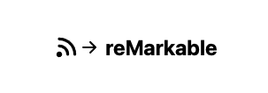

# rss-remarkable

This is an app for reading rss feeds on your reMarkable. `remarkable-rss` is running on NextJS and MongoDB. It uses a cronjob for parsing rss feeds periodically and syncs it to your reMarkable via the reMarkable Cloud.

**Call for contributions:** I'd love to maintain this as a community project. If you miss any feature or have other suggestions, feel free to create issues and/or pull requests!

